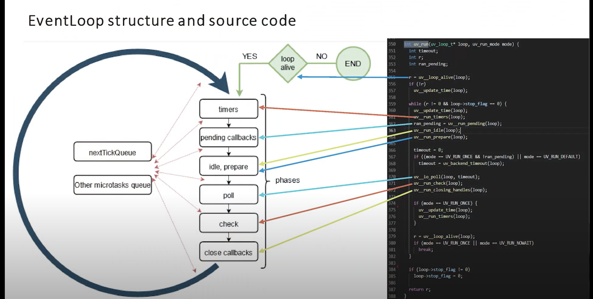

### Event Loop
- node js inner way to perform non-blocking I/O operations (by offloading to system kernel)
- handled by `libuv`
- have phases and two priority queues

Phases (by priority)

1. 'Timers' for callbacks, setTimeout, setInterval
2. 'Pending' (error callback, network connection)
3. 'Idle, prepare' (no external access)
4. 'Poll' - I/O (read files)
5. Check - setImmediate
6. Close callbacks (on(“close”))

Two separate priority queues:
1. nextTickQueue (process.nextTick())
2. microtasks (promises)

Event loop executes priority queues between phases. 
Event Loop executes all tasks inside one phase (e.g. all 5 setTimeouts)
Sync code is not related to Event Loop

Event loop structure

[Link](https://www.youtube.com/watch?v=7f787SsgknA) to a good video

<figure class="video_container">
  <iframe src="https://www.youtube.com/watch?v=7f787SsgknA" frameborder="0" allowfullscreen="true"> </iframe>
</figure>

